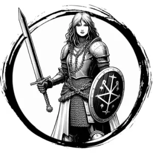

## SOLDIER

_An armed footsoldier trained in the ways of battlefield combat._

**AC** 15, **HP** 10, **ATK** 1 longsword +2 (1d8) or 1 crossbow (far) +1 (1d6), **MV** near, **S** 1 **D** 0 **C** 1 **I** 0 **W** 0 **Ch** 0, **AL** L, **LV** 2

