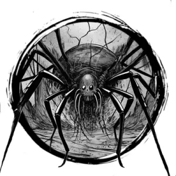

## SPIDER, GIANT

_Bulbous abdomen and eight, spindly legs. Dwells high in trees or caves and ambushes prey, capturing them to eat later._

**AC** 13, **HP** 13, **ATK** 1 bite +3 (1d4 + poison), **MV** near (climb), **S** +2 **D** +3 **C** +0 **I** -2 **W** +1 **Ch** -2, **AL** N, **LV** 3

**Poison:** DC 12 CON or paralyzed 1d4 hours.

