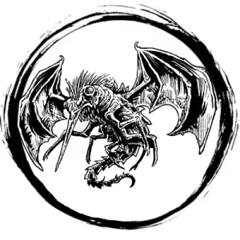

## STINGBAT

_Darting, orange insect-bat with four wings and needlelike beak._

**AC** 12, **HP** 4, **ATK** 1 beak +2 (1d4 + blood drain), **MV** near (fly), **S** -2 **D** 2 **C** 0 **I** -2 **W** 0 **Ch** -2, **AL** N, **LV** 1

**Blood Drain:** Attach to bitten target; auto-hit the next round. DC 9 STR on turn to remove.

