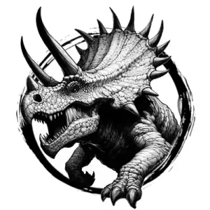

## TRICERATOPS

_Plodding herbivores with a wide, bony skull frill and three horns._

**AC** 17, **HP** 35, **ATK** 2 horns +6 (1d10) or 1 charge, **MV** near, **S** +4 **D** -1 **C** +4 **I** -3 **W** +1 **Ch** -3, **AL** N, **LV** 7

**Charge:** Move up to double near in straight line and make 1 horn attack. If hit, x3 damage.

