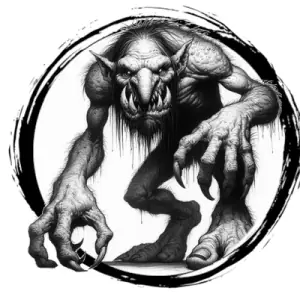

## TROLL

_Green, lanky giants with warty skin and territorial rage. Lair in deep forests and swamps._

**AC** 12, **HP** 24, **ATK** 2 claw +4 (1d6) and 1 bite +4 (1d10), **MV** near, **S** +3 **D** +2 **C** +2 **I** -1 **W** +0 **Ch** -1, **AL** C, **LV** 5

**Regenerate:** Regains 2d6 HP on its turn unless its wounds are cauterized with fire or acid.

