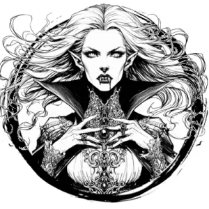

## VAMPIRE

_Pale, blood-drinking undead of supreme power and wickedness. They loathe sunlight and protect their coffins at all costs._

**AC** 15, **HP** 52, **ATK** 3 bite +7 (1d8 + blood drain) or 1 charm, **MV** near (climb), **S** +4 **D** +3 **C** +3 **I** +1 **W** +3 **Ch** +4, **AL** C, **LV** 11

**Supreme Undead:** Immune to morale checks. Only damaged by magical sources.

**Blood Drain:** Vampire heals 2d6 HP and target permanently loses 1d4 CON. At 0 CON, target dies and rises as vampire or vampire spawn (vampire chooses).

**Charm:** One humanoid target who can see vampire within near, DC 15 CHA or under vampire's control for 1d4 days.

**Shapechange:** In place of attacks, turn into a bat, wolf, or back into regular form.

**Vampire:** Must sleep in a coffin daily or loses 2d6 HP each day that can't be healed until resting in coffin. Takes 3d8 damage each round while in direct sunlight. Cannot be killed unless pierced through heart with a wooden stake while at 0 HP.

