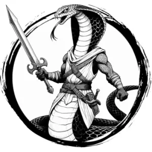

## VIPERIAN, OPHID

_A giant anaconda body merges into a humanoid torso with a large snake head. It wears golden torcs and strings of glittering moonstones._

**AC** 14, **HP** 28, **ATK** 3 falchion +5 (1d10) or 2 longbow (far) +3 (1d8), **MV** near (climb), **S** 4 **D** 2 **C** 1 **I** 1 **W** 1 **Ch** 1, **AL** C, **LV** 6

**Impervious:** Can only be harmed by magical sources.

