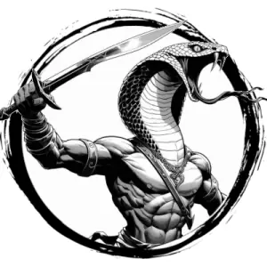

## VIPERIAN

_Lithe, snake-headed people with cobra hoods and emerald green scales covering their bodies._

**AC** 13, **HP** 13, **ATK** 2 scimitar +2 (1d6) or 1 javelin (close/far) +2 (1d4), **MV** near, **S** +1 **D** +1 **C** +0 **I** +0 **W** +1 **Ch** +0, **AL** C, **LV** 3

