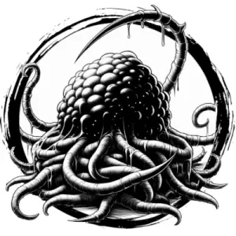

## VOID SPAWN

_Scythe-like limbs jut from a purple bulb as big as an ogre. Its lower half is a nest of tentacles._

**AC** 13, **HP** 34, **ATK** 2 scythe +6 (1d10) and 1 tentacles +6 (1d12 + toxin), **MV** near (fly), **S** +4 **D** +1 **C** +3 **I** +0 **W** +1 **Ch** -1, **AL** C, **LV** 7

**Impervious:** Immune to cold.

**Toxin:** DC 12 CON or paralyzed for 1d4 rounds.

