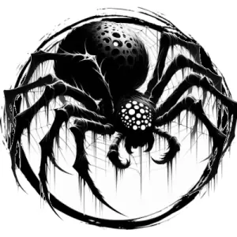

## VOID SPIDER

_Pale, horse-sized arachnids that become ghostly and intangible._

**AC** 13, **HP** 23, **ATK** 2 bite +4 (1d8 + poison), **MV** near (climb), **S** 3 **D** 3 **C** 1 **I** -1 **W** 1 **Ch** -2, **AL** C, **LV** 5

**Impervious:** Immune to cold.

**Phase:** Once per round, become corporeal or incorporeal.

**Poison:** DC 12 CON or drop to 0 HP in 1d4 rounds.

