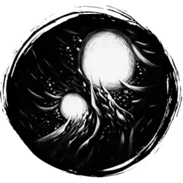

## WILL-O'-WISP

_A bobbing marsh light animated by an evil spirit. It tries to lead the living into danger._

**AC** 13, **HP** 10, **ATK** 1 life drain +3, **MV** near (fly), **S** -3 **D** 3 **C** 1 **I** -1 **W** -1 **Ch** -2, **AL** C, **LV** 2

**Life Drain:** 1d4 CON damage. Death if reduced to 0 CON.

