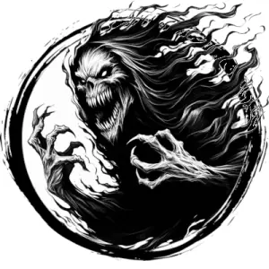

## WRAITH

_A shadowy spirit seething with anger and malice. Its presence is unsettling to animals._

**AC** 14, **HP** 36, **ATK** 3 death touch +6 (1d10 + life drain), **MV** near (fly), **S** -4 **D** 4 **C** 0 **I** 0 **W** 0 **Ch** 3, **AL** C, **LV** 8

**Greater Undead:** Immune to morale checks. Only damaged by silver or magical sources.

**Incorporeal:** In place of attacks, become corporeal or incorporeal.

**Life Drain:** 1d4 CON damage. Death if reduced to 0 CON.

