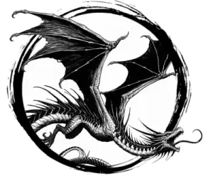

## WYVERN

_Dragon-cousins with a large tail stinger, mottled lizard skin, and leathery wings._

**AC** 15, **HP** 37, **ATK** 2 rend +6 (1d8) and 1 stinger +6 (1d6 + poison), **MV** double near (fly), **S** 4 **D** 2 **C** 1 **I** -3 **W** 1 **Ch** -3, **AL** N, **LV** 8

**Poison:** DC 15 CON or take 2d10 damage.

